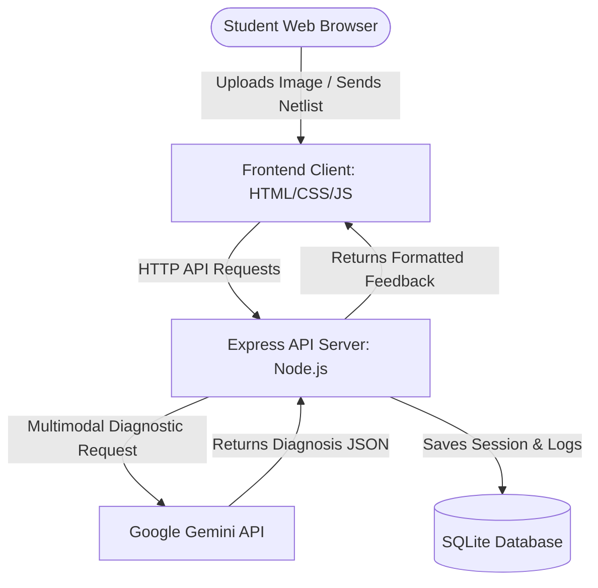

# BreadboardVision

[](https://github.com/kuya-carlo/md)

An AI-powered virtual circuit tutor designed to help introductory engineering students troubleshoot physical and virtual circuits using vision and guided netlist diagnostics.


## 📖 Product Overview
BreadboardVision bridges the gap between hands-on hardware and step-by-step diagnostic feedback. Beginning students often get stuck on simple electronics wiring errors, waiting hours for laboratory instructors. BreadboardVision allows students to upload a screenshot of their simulator circuit (or a photo of their physical breadboard) or input their circuit connections in text. The underlying Gemini-driven AI model parses the input, identifies wiring errors (like short circuits or open loops), and provides clear step-by-step instructions on how to correct the board, making electronics labs self-paced and stress-free.

---

## 🏛️ Constitution Summary
- **Scope Limit:** Strictly limited to 5 core features in HACKATHON scope (AI Netlist diagnostics, simulator screenshots, judge demonstration panel, responsive UI, session history database).
- **Safety First:** Graceful fallbacks. If computer vision fails, the system pivots to a text-based netlist troubleshooter.
- **Scorecard Driven:** Prioritizes high presentation value, a smooth demo script, and zero-install client interfaces to optimize judges' grading.

---

## ⚙️ System Architecture



---

## 🚀 Quickstart

Get BreadboardVision running on your local server in under 2 minutes:

```bash
# Clone the repository
git clone https://github.com/your-username/breadboard-vision.git
cd breadboard-vision

# Set up your environment variables (Add your Gemini API Key)
cp .env.example .env

# Install packages
npm install

# Seed the database
npm run db:init

# Run the development server
npm run dev
```

Open your browser to `http://localhost:3000` to start debugging circuits.
