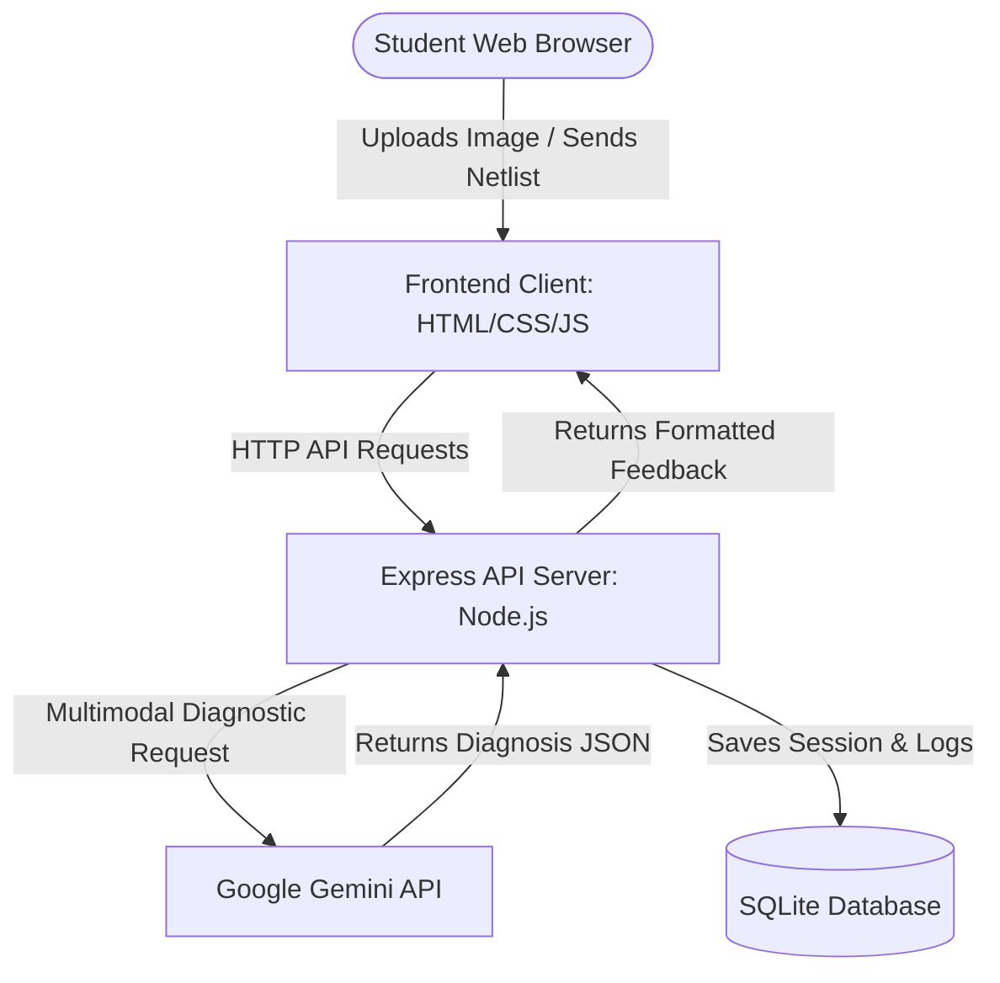
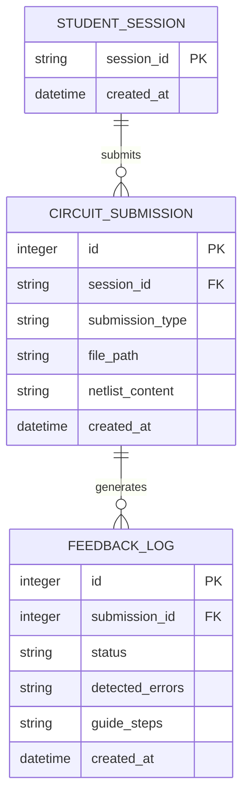

# Technical Specification - BreadboardVision

## Recommended Stack
- **Frontend**: Vanilla HTML5, CSS3 (with responsive flex/grid layouts), and modern ES6 JavaScript. Custom SVG rendering for circuit nodes and feedback overlays. Google Fonts (Outfit/Outfit) for clear typography.
- **Backend**: Node.js with Express for routing, handling API requests, and communicating with the AI models.
- **Database**: SQLite (via `better-sqlite3`) for simple, lightweight file-based data persistence (session state and feedback history).
- **AI Engine**: Google Gemini 1.5 Flash API (via Google AI Studio SDK or raw fetch) for multimodal circuit image analysis and netlist diagnostics.
- **Hosting**: Vercel or Render for web services.

## System Architecture

## Component Estimates

| Component | Description | Estimated Hours |
|-----------|-------------|-----------------|
| **Project Foundation** | Server configuration, SQLite setup, environment variables initialization. | 2 hours |
| **Database & Schema Setup** | Session migrations, submission logs, and seed files for mock circuits. | 2 hours |
| **Gemini Integration** | System prompts tuning, image-to-text formatting, and netlist parsing logic. | 4 hours |
| **REST API Server** | Endpoints for analysis (image and text inputs), session tracking. | 3 hours |
| **Interactive UI & Canvas** | HTML5 camera interface, image upload, form input for netlists, visual feedback. | 5 hours |
| **Mock Simulator Mode** | Built-in mock data for judges to run instantly without external cameras. | 2 hours |
| **Total** | | **18 hours** |

## Core Data Model

### Schema Details
1. **STUDENT_SESSION**: Tracks student usage sessions.
   - `session_id`: TEXT (UUID or session string)
   - `created_at`: TEXT (ISO8601 Timestamp)

2. **CIRCUIT_SUBMISSION**: Individual troubleshooting attempts.
   - `id`: INTEGER (Auto-increment)
   - `session_id`: TEXT (Foreign Key -> STUDENT_SESSION)
   - `submission_type`: TEXT (`'image'`, `'netlist'`)
   - `file_path`: TEXT (nullable, path to uploaded screenshot/photo)
   - `netlist_content`: TEXT (nullable, netlist text representation)
   - `created_at`: TEXT (ISO8601 Timestamp)

3. **FEEDBACK_LOG**: The analysis returned by the AI assistant.
   - `id`: INTEGER (Auto-increment)
   - `submission_id`: INTEGER (Foreign Key -> CIRCUIT_SUBMISSION)
   - `status`: TEXT (`'correct'`, `'warning'`, `'error'`)
   - `detected_errors`: TEXT (JSON array of error details)
   - `guide_steps`: TEXT (JSON array of remediation instructions)
   - `created_at`: TEXT (ISO8601 Timestamp)

## Critical API Endpoints

1. `POST /api/analyze/image` - Analyze an uploaded circuit screenshot/photo.
2. `POST /api/analyze/netlist` - Analyze a text-based circuit netlist configuration.
3. `GET /api/sessions/:id/history` - Retrieve session history and past feedbacks.

## External Dependencies
- `express`: Minimalist Node web framework.
- `better-sqlite3`: High-performance SQLite wrapper for Node.
- `dotenv`: Environment configuration manager.
- `@google/generative-ai`: Google AI SDK for Gemini models.
